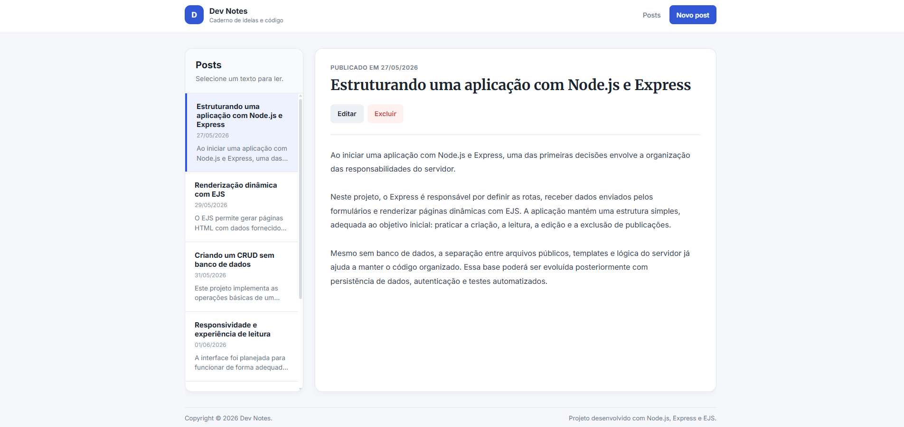

# Dev Notes

A responsive blog application built with Node.js, Express and EJS.

The project allows users to create, browse, update and delete blog posts through a server-rendered interface. It was developed as a capstone project to practice Express routing, form handling, dynamic EJS templates and responsive CSS layouts.

## Preview



## Features

* Create new blog posts
* Browse posts through a sidebar list
* View the full content of a selected post
* Edit existing posts
* Delete posts with confirmation
* Validate required title and content fields
* Display creation and update dates
* Responsive layout for desktop and mobile devices
* Independent scrolling for post lists and long content
* Reusable EJS partials for header and footer

## Tech Stack

* Node.js
* Express.js
* EJS
* JavaScript
* CSS

## Project Structure

```text
blog-capstone/
├── public/
│   └── styles/
│       └── main.css
├── views/
│   ├── partials/
│   │   ├── footer.ejs
│   │   └── header.ejs
│   ├── edit-post.ejs
│   ├── index.ejs
│   └── new-post.ejs
├── .gitignore
├── index.js
├── package-lock.json
├── package.json
└── README.md
```

## Routes

| Method | Route               | Description                                         |
| ------ | ------------------- | --------------------------------------------------- |
| `GET`  | `/`                 | Displays the post list and the first available post |
| `GET`  | `/posts/new`        | Displays the post creation form                     |
| `POST` | `/posts`            | Creates a new post                                  |
| `GET`  | `/posts/:id`        | Displays a selected post                            |
| `GET`  | `/posts/:id/edit`   | Displays the post editing form                      |
| `POST` | `/posts/:id/edit`   | Updates an existing post                            |
| `POST` | `/posts/:id/delete` | Deletes an existing post                            |

## Getting Started

### Prerequisites

* Node.js
* npm

### Installation

Clone the repository:

```bash
git clone https://github.com/CardosoRepository/blog-capstone.git
cd blog-capstone
```

Install the dependencies:

```bash
npm install
```

Start the application:

```bash
npm start
```

Open the application in your browser:

```text
http://localhost:3000
```

## Data Persistence

This version does not use a database. Posts are stored in memory and reset whenever the server restarts.

## Future Improvements

* Add database persistence
* Add automated tests
* Add a custom 404 page
* Replace POST-based update and delete routes with PUT and DELETE requests
* Add pagination or search for large post collections
* Add user authentication
* Deploy the application to a Node.js hosting service

## About

Capstone blog application developed to practice Node.js, Express, EJS and responsive interface design.
